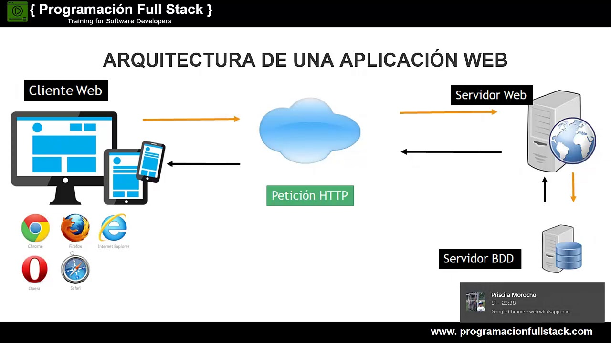

# Introducción

En este tutorial vamos a crear una aplicación web que permite a través del framework `django`, consultar y modificar un fichero csv utilizando la librería `pandas`.

## Aplicacion web
Enlaces: <https://es.wikipedia.org/wiki/Aplicaci%C3%B3n_web>

Una aplicación web consiste en una aplicación que corre en un servidor y es accedida a través de un navegador desde la computadora del usuario. 

Ventajas:
* Cliente liviano
* Multiplataforma (con algunas consideraciones)
* Colaboración (datos compartidos)
* Actualizaciones inmediatas

Tener cuidado con:
* Consistencia
* Latencia entre el servidor y el cliente
* En principio todos los mensaje los inicia el cliente (ya sea el usuario o a través de código que corre en la máquina del usuario)
* Disponibilidad

### HTML (HyperText Markup Language)
Enlace: <https://developer.mozilla.org/en-US/docs/Web/HTML>

Es un lenguaje de marcas que le dice al navegador como ordenar la información y su significado.

Se utiliza muchas veces junto con CSS para la presentación y Javascript para la funcionalidad.

### HTTP (Hypertext Transfer Protocol)
Enlaces: <https://developer.mozilla.org/en-US/docs/Web/HTTP/Overview>

HTTP es un protocolo que permite el intercambio de archivos de texto a través de la red.

Hay varios tipos de menaje con diferentes significados, pero los más importantes son:
* GET que sirve para descargar información desde el servidor hacia el cliente.
* POST que sirve para mensajes que hacen cambios en el servidor.

A través de las cabeceras ("headers") se pueden enviar información extra del cliente o controlar funcionalidades complejas de http como el envío de información comprimida, entre otras funcionalidades.

## Django

Enlaces:
* <https://www.djangoproject.com/start/overview/>
* <https://developer.mozilla.org/en-US/docs/Learn/Server-side/Django/Introduction>

Django es un framework que permite crear aplicaciones web de forma rápida y simple. 

Ventajas :
* Seguridad: tiene varias consideración de seguridad implementadas en el framework
* Mantenibilidad
* Portabilidad

## Pandas
Enlaces: <https://pandas.pydata.org/docs/index.html>

Pandas es una librería que permite manejar tablas de datos de una manera fácil e intuitiva.

Otra gran ventaja es que tiene integración con muchas otras librerías de Python, lo que permite hacer tareas complejas con pocas líneas de código.

# Tutorial

## Crear proyecto de Django

1. Descargar e instalar applicaciones: 
  * Python: <https://www.python.org/downloads/>
  * Visual Studio Code: <https://code.visualstudio.com/download>

2. Creamos un ambiente de python para instalar los paquetes adecuados sin modificar nuestro sistema:

		> python -m venv env

3. Para activar el ambiente de trabajo usar:
* En Windows:
			
      > env\Script\activate.bat
* En Linux:

	  > source env/bin/activate

4. Instalar Django and revisar instalacion (<https://www.djangoproject.com/>)
		
		> pip install django
		> python -m django --version

## Pandas

1. Agregamos pandas y matplotlib como referencia en un archivo requeriments.txt

2. Instalar paquetes:
    
		> pip install -r requirements.txt
  
3. Descargar dataset de ejemplo: <https://www.kaggle.com/datasets/yersever/500-person-gender-height-weight-bodymassindex>

4. Ver como tratar con la data en pandas
    
		> python
    	$ import pandas as pd
    	$ personas = pd.read_csv("data/500_Person_Gender_Height_Weight_Index.csv")
    	$ personas.columns
    	$ personas.head(5)
    	$ personas["pesos"].mean()
  
5. Mostrar plots para entender data

       $ import matplotlib.pyplot as plt
       $ personas.plot.scatter("altura","peso")
       $ plt.show()
       $ livianas = personas[personas["Index"] == 1]
       $ livianas.plot.scatter("altura","peso")
       $ plt.show()

## Tabla en Django

1. Agregar pagina de templates a la configuración

1. Crear template para index.

2. Crear template para lista de personas. (<https://www.w3schools.com/html/html_tables.asp>)

## Agregar bootstrap 
Enlaces:
* <https://django-bootstrap-v5.readthedocs.io/en/latest/index.html>
* <https://github.com/zelenij/django-bootstrap-v5/tree/main/example>

1. Instalar paquete django-bootstrap-v5

2. Agregar clases a tabla

3. Agregar navegador (<https://getbootstrap.com/docs/5.0/components/navbar/>)

4. Exportar navegador a base.html (<https://docs.djangoproject.com/en/4.0/ref/templates/language/#templates>)

5. Agregar tarjeta con estadisticas (<https://getbootstrap.com/docs/4.0/components/card/>)

## Agregar form para añadir data 
Enlaces: <https://docs.djangoproject.com/en/4.0/topics/forms/>

1. Crear formulario

2. Crear template con bootstrap (<https://django-bootstrap-v5.readthedocs.io/en/latest/quickstart.html>)

3. Agregar url

4. acción de agregar

## Exponer servicio

1. Iniciar servicio en todas las interfaces 
  
  	   > python mange.py runserver 0.0.0.0:8000

2. Consultar ip
 
		> ipconfig

3. Acceder con el celular (da error)

4. Agregar IP y localhost a allowed hosts.

5. Acceder con el celular nuevamente.